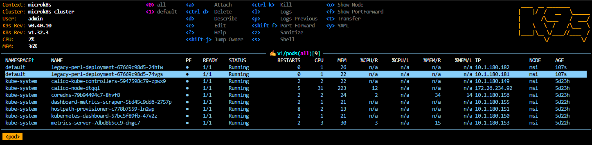
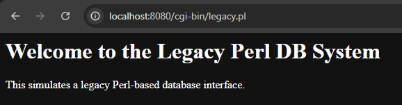

# 🐳 Legacy Perl DB Wrapper – Kubernetes Edition

This project simulates containerizing a legacy Perl-based database interface and deploying it on a secure, local Kubernetes cluster using modern DevOps tools.

  


---

## 📦 Features

- Perl CGI script simulating a legacy DB interface
- Containerized with Apache and mod_perl
- Secure deployment (non-root user, limited privileges)
- Kubernetes-ready with MicroK8s
- Cluster monitored via `k9s`
- Local development with Docker

---

## 🚀 Running Locally (Docker)

```bash
docker build -t legacy-perl-app:latest .
docker run -p 8080:8080 legacy-perl-app
```

Then visit:  
[http://localhost:8080/cgi-bin/legacy.pl](http://localhost:8080/cgi-bin/legacy.pl)

---

## ☁️ Deploying to Kubernetes

### 1. Save and Import Docker Image

```bash
docker save legacy-perl-app:latest -o legacy-perl-app.tar
microk8s ctr image import legacy-perl-app.tar
```

### 2. Apply Manifests

```bash
microk8s kubectl apply -f k8s/
```

### 3. Port Forward to Access App

```bash
microk8s kubectl port-forward service/legacy-perl-service 8080:8080
```

Then visit:  
[http://localhost:8080/cgi-bin/legacy.pl](http://localhost:8080/cgi-bin/legacy.pl)

---

## 🔐 Security Notes

- Runs as a non-root user in the container
- Ports and file permissions adjusted for safe operation
- NetworkPolicy and RBAC ready for expansion

---

## 📎 Future Improvements

- Add CI/CD with GitOps (Flux)
- Configure Ingress for external access
- Prepare deployment to a managed cloud Kubernetes platform

---

## 🧙‍♂️ Author

**slothlysage**  
[https://slothlysage.com](https://slothlysage.com)
